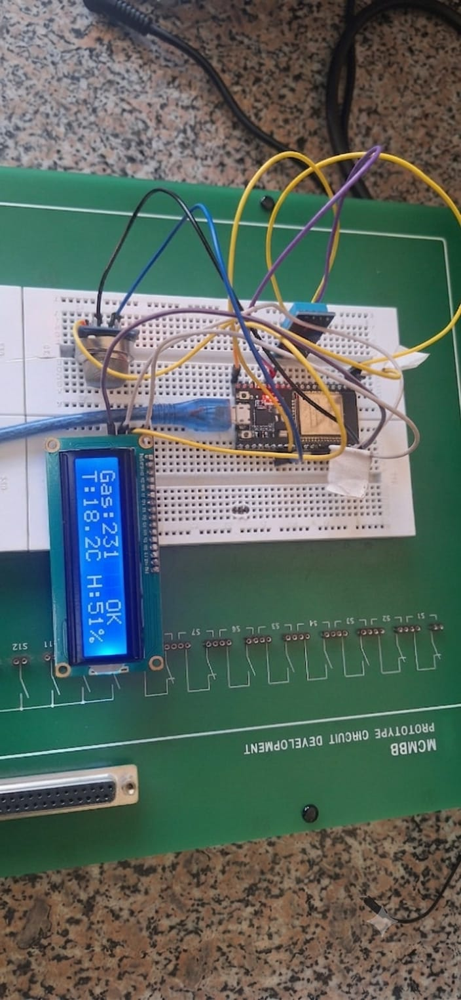
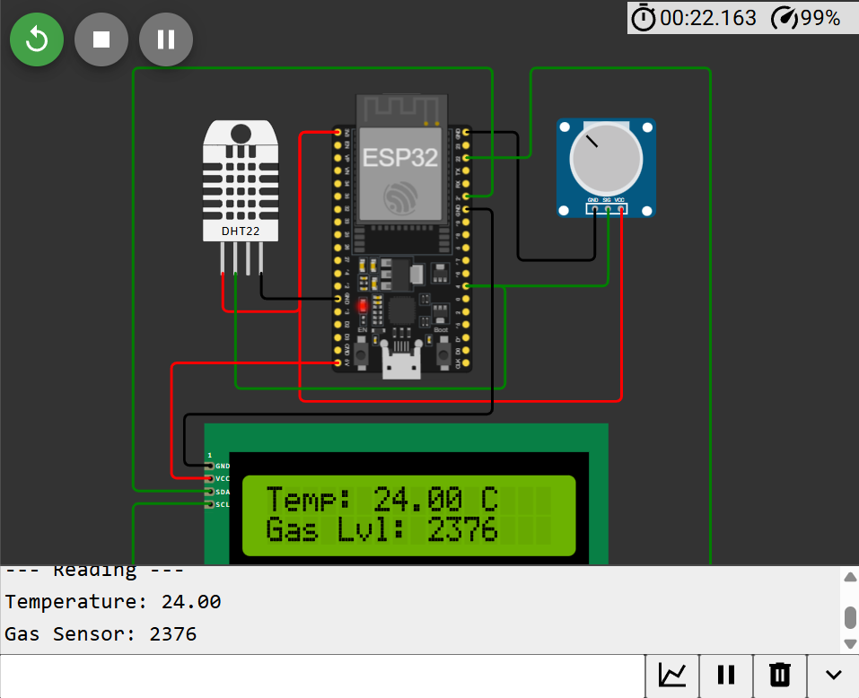
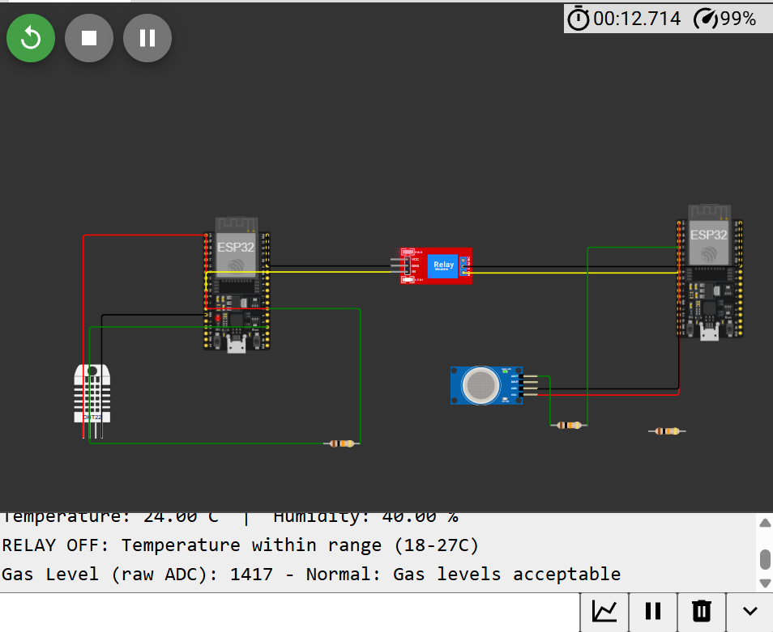
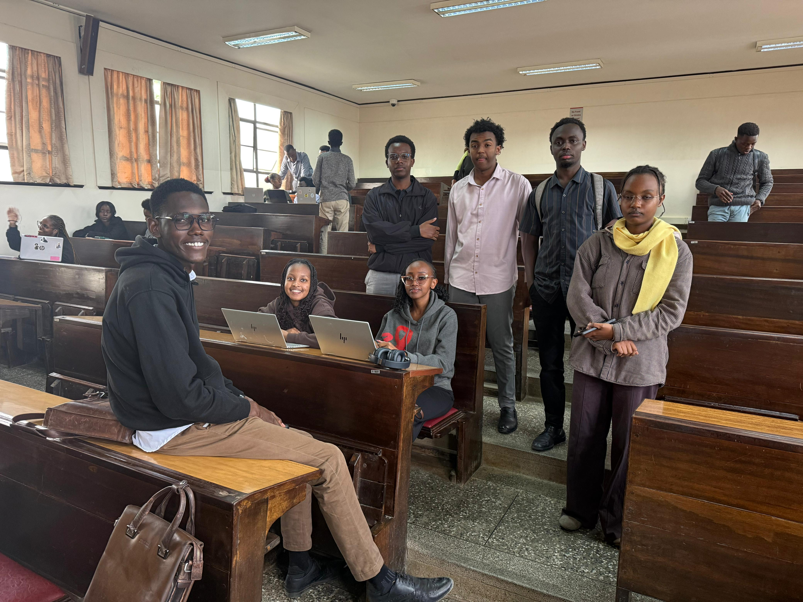

# ICS 4111 – Embedded Systems & IoT

## Semester Project – Deliverable 2

### Embedded Device Prototypes Using ESP32

---

**Institution:** Strathmore University

**Group:** Group 1: The Resistance

---

## Team Members

- Edgar Kareithi – 164951
- Mohamed Bile – 152802
- Evans Mwendwa – 166997
- Annejoy Warigi – 169915
- Tim Hubert – 166070
- Hope Murimi – 150468
- Martha Muinde – 166319

---

## Project Overview

This repository contains the implementation of the Semester Project, Deliverable 2 for the ICS 4111 Embedded Systems & IoT course. The project focuses on the design, implementation, and testing of embedded system prototypes using ESP32 microcontrollers and various sensors through both physical hardware and Wokwi simulations.

The prototypes demonstrate sensor integration, communication between ESP32 devices, environmental monitoring, gas detection, relay control, and LCD output. Each prototype is documented with its architecture, implementation, source code, simulation link, output, and supporting evidence.

---

## Table of Contents

- [Project Overview](#project-overview)
- [Prototype A](#prototype-a)
- [Prototype B](#prototype-b)
- [Prototype C](#prototype-c)
- [Prototype D](#prototype-d)
- [Challenges Encountered](#challenges-encountered)
- [Evidence of Group Work](#evidence-of-group-work)
- [Repository Structure](#repository-structure)
- [Conclusion](#conclusion)

  ---

# Prototype A
## Description

This prototype consists of one ESP32 microcontroller connected to an MQ-5 gas sensor, a DHT22 temperature and humidity sensor, and a 16×2 LCD display. The system continuously monitors environmental conditions and gas concentration, displaying the readings on the LCD while simultaneously sending the data to the Serial Monitor.

## Physical Prototype

## Wokwi Simulation

**Simulation Link:**

https://wokwi.com/projects/467714861679761409

## Source Code

The complete source code for Prototype A is available in:

[Prototype A Code](code/prototype-A/)

## Working Principle

1. The ESP32 initializes the DHT22 sensor, MQ-5 gas sensor, and LCD display.
2. The DHT22 measures temperature and humidity.
3. The MQ-5 detects gas concentration.
4. Sensor readings are processed by the ESP32.
5. The measured values are displayed on the LCD.
6. The same values are sent to the Serial Monitor for monitoring.

## Output

The prototype successfully displays temperature, humidity, and gas concentration readings on the LCD while transmitting the same information to the Serial Monitor.

---

# Prototype B

## Description

Prototype B demonstrates communication between two ESP32 microcontrollers. One ESP32 is connected to an MQ-5 gas sensor while the second ESP32 is connected to a DHT22 temperature and humidity sensor. The two ESP32 boards exchange sensor data, allowing environmental information to be collected and displayed in real time.

## Components Used

| Component | Quantity |
|-----------|---------:|
| ESP32 Dev Board | 2 |
| MQ-5 Gas Sensor | 1 |
| DHT22 Sensor | 1 |
| 16×2 LCD Display | 1 |
| Breadboard | 2 |
| Jumper Wires | As Required |

## Physical Prototype

---

# Prototype C
## Description

Prototype C demonstrates communication between two ESP32 microcontrollers using a relay-controlled architecture. One ESP32 interfaces with a DHT22 temperature and humidity sensor while the second ESP32 interfaces with an MQ-5 gas sensor. The relay is used as a control mechanism between the two embedded systems to simulate coordinated operation.

## Components Used

| Component | Quantity |
|-----------|---------:|
| ESP32 Dev Board | 2 |
| DHT22 Sensor | 1 |
| MQ-5 Gas Sensor | 1 |
| Relay Module | 1 |

## Wokwi Simulation

**Simulation Link:**

https://wokwi.com/projects/468541541280012289

## Source Code

The complete implementation for Prototype C is available in:

[Prototype C Code](code/prototype-C/)

## Working Principle

1. ESP32-1 continuously monitors temperature and humidity using the DHT22 sensor.
2. The collected sensor data is used to control the relay module.
3. The relay coordinates the interaction between the two ESP32 microcontrollers.
4. ESP32-2 monitors gas concentration using the MQ-5 sensor.
5. Both microcontrollers operate together to demonstrate distributed sensing and control.

## Expected Output

The prototype is expected to:

- Measure temperature and humidity using the DHT22 sensor.
- Detect gas concentration using the MQ-5 sensor.
- Activate or deactivate the relay based on the programmed control logic.
- Demonstrate successful interaction between the two ESP32 microcontrollers.
- Display the expected behaviour correctly in the Wokwi simulation.

---

# Evidence of Group Work

The project was completed collaboratively by all group members.

Evidence of group participation is provided below.

---

# Conclusion

The project successfully demonstrated the design and implementation of embedded IoT systems using ESP32 microcontrollers, sensors, and Wokwi simulations. Physical and simulated prototypes were developed to validate sensor integration, communication between devices, and system functionality. The project also provided practical experience in hardware integration, embedded programming, simulation, and troubleshooting.
